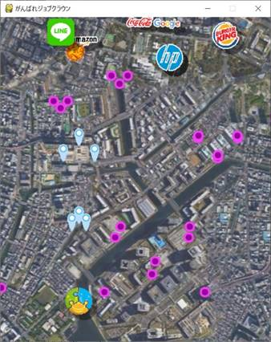
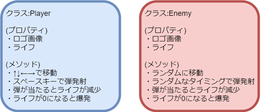
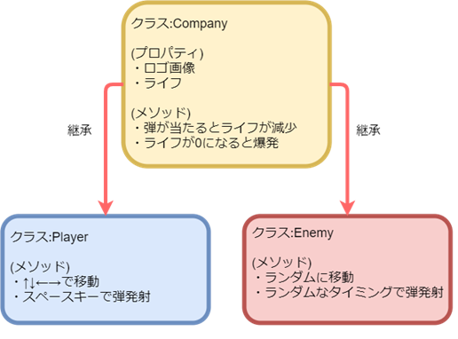

***********************************************************
クラス
***********************************************************

.. line-block::
    :class: mb0

    この章ではジョブクラウンが巨大企業に立ち向かっていく系のシューティングゲーム「がんばれジョブクラウン」というゲームを作成(未完成)したので、ゲームのプログラムを通してクラス (ついでにライブラリも) について学んでいきます。

    ↓ゲーム実行イメージ

まずはゲームをプレイしてみよう
###########################################################

.. line-block::
    :class: mb0

    ゲームのソースは下記リンクのファイル内 shooting_game 以下のファイルを使用します。
    https://github.com/TaroTsuyama/py_study/archive/master.zip

    ファイル一式を PC の適当な場所にダウンロードして Python で実行してみましょう。(Windows 以外で動くかはわかりません…)
    Python をダウンロードしたままではゲームは動かないので、コマンドプロンプト(またはターミナル)で次のコマンドを実行してください。

.. code-block:: python

    pip install pygame
    pip install numpy

.. line-block::
    :class: mb0

    なお、mac では特に設定していない場合 pip3 とする必要があります。

    ↑ ↓ ← → のキーでジョブクラウンを動かして、スペースキーで攻撃します。
    敵の弾が 3 回当たったらゲームオーバーです。敵同士でつぶしあうこともあります。
    ご覧の通り、スコア等の表示もなく効果音もありません。

    また、私はゲーム制作の経験がないので「ゲームのサンプルコード」としてはあまり参考にならないかもしれません。

クラスとは
###########################################################

.. line-block::
    :class: mb0

    クラスとは、簡単に言えばオブジェクトの設計図です。
    オブジェクトとは :doc:`iterable` で簡単に説明してある通り物体を模したデータのことで、オブジェクト指向というプログラミングの方式においてとても重要な概念です。

    クラスはあくまでも設計図なので、それ単体では機能しません。
    その設計図からモノを作って利用します。
    クラスから作成したオブジェクトを **インスタンス** といいます。

    たとえば、車を表すクラス Car を次のように定義します。
    .py ファイルを作成して実行しましょう。

.. code-block:: python

    class Car:
        color = "white" # 車体カラー
        exhaust = 1800 # 排気量
        speed = 0 # 速度

        def acceleration(self): # 加速メソッド
            self.speed += 1

        def deceleration(self): # 減速メソッド
            self.speed -= 1

.. line-block::
    :class: mb0

    クラス内で変数を定義するとプロパティとなり、関数を定義するとメソッドになります。
    メソッドの第一引数は自分自身を表す self というキーワードを指定します。

    定義したクラスのインスタンスを生成するには以下のようにします。

.. code-block:: python

    car1 = Car()

.. line-block::
    :class: mb0

    この変数car1はCar型のオブジェクトといえます。
    内部には定義したプロパティやメソッドを持っています。

    オブジェクトのプロパティやメソッドにアクセスするには . (ドット) 区切りで指定します。

.. code-block:: python

    print(car1.color) # white
    car1.acceleration() # メソッド acceleration を呼び出す。カッコを忘れずに！
    print(car1.speed) # 1

.. line-block::
    :class: mb0

    また、下記のようにプロパティを直接書き換えてしまうことも可能です。

.. code-block:: python

    car1.color = "red"

.. line-block::
    :class: mb0

    しかし、これではいろいろ不都合があるのです。
    上記の例では文字列で "red" としていましたが、例えば数値で 100 とか本来想定されている型以外の値が入力されたらプログラムは正しく動かないということは想像できるでしょうか。

property と setter
###########################################################

.. line-block::
    :class: mb0

    プロパティを直接書き換えさせたくないときは property と setter を使います。

    覚えなくてもいいとは思いますが、処理の内容は理解できるようにしましょう。

.. code-block:: python

    class Car:
        _color = "white"

        @property # プロパティを参照するときはこちらが呼び出される
        def color(self):
            return self._color

        @color.setter # プロパティを書き換えるときはこちらが呼び出される
        def color(self,color_string):
            if type(color_string) == str: # 引数の型が str の時のみ書き換えを行う
                self._color = color_string

    car2 = Car()
    print(car2._color) # white

    car2.color = 100
    print(car2._color) # white

    car2.color = "red"
    print(car2._color) # red

.. line-block::
    :class: mb0

    上記の例だと Car クラスの車体カラーを表す変数は先頭にアンダースコアが付いた _color となっているのですが、インスタンスでアクセスしているアトリビュートにはアンダースコアがない color となっています。
    これは Car クラスの車体カラーを表す変数を内部的には _color とすることでデータを **隠ぺい** しているのです。

    color でアクセスしているのは property および setter なのです。
    プロパティを参照しようとすると property の処理が呼ばれ、代入しようとすると setter の処理が呼ばれます。
    setter で代入しようとする値の要件をチェックするような処理を行うと、想定していないデータは代入できない賢いプログラムができるのです。

コンストラクタ
###########################################################

.. line-block::
    :class: mb0

    クラスのインスタンスを生成するときにプロパティを引数で指定したいという場合があります。
    そんな時はコンストラクタを使います。
    また、初期値としたいプロパティもコンストラクタ内に記述するのが一般的だと思います。

.. code-block:: python

    class Car:
        def __init__(self, color, exhaust):
            self.color = color
            self.exhaust = exhaust
            self.mileage = 0 # 走行距離。初期値として0を設定。

    car3 = Car("blue", 2500)
    car4 = Car("white", 1800)

.. line-block::
    :class: mb0

    **__init__** というメソッドがコンストラクタです。
    他のメソッド同様に第一引数はselfというキーワードを指定します。
    Carクラスのインスタンス生成時に引数を渡すことで異なるパラメータを持ったインスタンスが生成されていることがわかるでしょうか。

    なお、コンストラクタ以外のメソッドにも当てはまるのですが、第一引数の self はメソッドの呼び出し時には入力する必要はありません。
    つまり、Car(self, "blue", 2500) ではなく Car("blue", 2500) となるわけです。

継承
###########################################################

.. line-block::
    :class: mb0

    オブジェクト指向プログラミングを行う上で重要な概念の一つに **継承** (インヘリタンス) というものがあります。
    これは、すでにあるクラスの機能を引き継いで派生した別のクラスを作ることができるというものです。

    例えば、今回作成したサンプルプログラムでは自機を表す Player クラスと、敵機を表す Enemy クラスがあるのですが、これらは下図のように一部に共通の機能を持っています。

.. line-block::
    :class: mb0

    この、共通する機能について修正がある場合、同じ機能を持つすべてのクラスを修正する必要があります。
    そんなとき、共通する部分を一つのクラスにまとめて、そこからそれぞれ派生したクラスに継承させれば修正は一度で済むし修正ミスの心配も減るしコードもすっきりするのです。

.. line-block::
    :class: mb0

    この継承元のクラスを親クラス (またはスーパークラス)、継承先のクラスを子クラスと言ったりします。

ゲームのプログラムを見てみよう
###########################################################

.. line-block::
    :class: mb0

    ここまで来たらサンプルゲームのコードが少しはわかるようになっているはずです。

    サンプルゲームは今のところ下記のような問題があります。

* 音がない
* スコア表示がない
* 弾のパターンが 1 種類しかない → アイテム等を取得すると変化するようにしたい
* 敵の動き方がきもちわるい
* ライフ残量がわからない→自機のライフ表示したい
* ライフが 3 で固定 → 敵機のライフは変化させたい
* コードを我流で書いている部分が多くあるのですっきりさせたい。

.. line-block::

    他にもいろいろあると思います。
    各自コードを自由に改変して、より面白いゲームをぜひ作ってみてください！(投げやり)

    結構いい加減な部分もあると思いますが、きっと Python を学ぶ上でヒントになることは少なくないと思います。
    わからないことがあればどんどん聞いてください！
