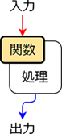
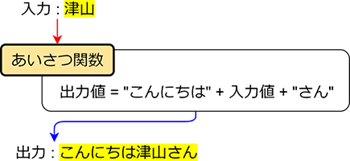
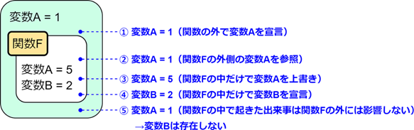
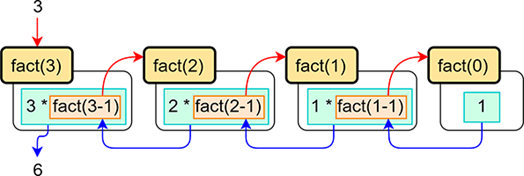

***********************************************************
関数
***********************************************************

関数とは
###########################################################

.. line-block::
    :class: mb0

    プログラミング言語でいうところの関数とは「いくつかの処理をまとめて、ひとつの機能にしたもの」といえます。

    関数といえば Excel にもありますよね。
    あれも仕組みとしてはプログラミング言語の関数と同等のものです。

    例として Excel の SUM 関数を見てみましょう。
    これは渡したセルに含まれる数値の合計値を返すという関数です。

.. image:: _static/image019.png

.. line-block::
    :class: mb0

    この「渡す」とか「返す」といった概念が重要で関数に渡すデータのことを **引数（ひきすう）** 、関数が返すデータのことを **戻り値** または返り値といったりします。

    関数は引数でデータを入力して、関数の内部で処理を行ったデータを戻り値として出力するというのが最も一般的な形です。（引数や戻り値のない関数もあります）

組込み関数
###########################################################

.. line-block::

    組込み関数とは、あらかじめ用意されている関数のことです。
    Python の組込み関数は下記ページに記載されています。
    https://docs.python.org/ja/3/library/functions.html

    よく使う組込み関数についていくつか紹介していきます。

print 関数
***********************************************************

.. line-block::
    :class: mb0

    引数で渡したデータをコンソールに表示する関数。
    この関数は戻り値がありません。

.. code-block:: python

    print("jobcrown") # 画面に文字を表示するだけで、戻り値は返さない。

abs 関数
***********************************************************

.. line-block::
    :class: mb0

    引数で渡した数値の絶対値を返す。

.. code-block:: python

    value1 = -10
    value2 = abs(value1) # abs 関数の戻り値を変数 value2 に代入
    print(value1, value2) # -10 10

len 関数
***********************************************************

.. line-block::
    :class: mb0

    引数で渡したイテラブルオブジェクトの要素数を返す。

.. code-block:: python

    value_list = [1,2,3,4,5]
    string = "jobcrown"
    print(len(value_list)) # 5
    print(len(string)) # 8

zip 関数
***********************************************************

.. line-block::
    :class: mb0

    二つのイテラブルオブジェクトの各項目を組み合わせたタプルを列挙したイテラブルオブジェクトを返す。
    (あまり使いませんが Python3 エンジニア認定基礎試験で出題されるので紹介します。)

.. code-block:: python

    value_list1 = [1,2,3,4,5]
    value_list2 = [6,7,8,9]
    string = "jobcrown"

    zip_obj1 = zip(value_list1, value_list2)
    zip_obj2 = zip(zip_obj1, string)

    print(list(zip_obj1)) # [(1, 6), (2, 7), (3, 8), (4, 9)]
    print(list(zip_obj2)) # [((1, 6), 'j'), ((2, 7), 'o'), ((3, 8), 'b'), ((4, 9), 'c')]

map 関数
***********************************************************

.. line-block::
    :class: mb0

    イテラブルオブジェクトの各要素に対して引数で指定した関数を実行したものを列挙したイテラブルオブジェクトを返す。

.. code-block:: python

    arr = [
        1,
        2.3,
        "4",
        [5,6],
        (7,8),
        {9,10},
        {11:12},
        True,
        None,
    ]

    map_obj = map(type, arr)

    for data in map_obj:
        print(data)

ユーザ定義関数
###########################################################

.. line-block::
    :class: mb0

    関数はユーザが自由に定義することもできます。
    関数の定義には **def 構文** を使用します。

.. code-block:: python

    def 関数名(引数):
        処理
        return 戻り値

.. line-block::
    :class: mb0

    例として下記のような「あいさつ関数」を定義してみましょう。

.. code-block:: python

    def greeting(name):
        message = "こんにちは" + name + "さん"
        return message

    print(greeting("津山")) # こんにちは津山さん

位置引数とキーワード引数
***********************************************************

.. line-block::
    :class: mb0

    関数を呼び出すとき、引数を指定する方法として位置引数とキーワード引数というものがあります。

    例えば、下記のような関数を考えます。

.. code-block:: python

    def some_func1(item_name, value, message):
        return f"商品名 : {item_name}\n価格 : {value}\n説明 : {message}"

.. line-block::
    :class: mb0

    関数を呼び出すとき、関数定義で定義してある引数 ( **仮引数** といいます) と同じ位置で引数を指定する方式を **位置引数** といいます。

.. code-block:: python

    print(some_func1("商品A", 100, "これは商品Aです"))

.. line-block::
    :class: mb0

    関数を呼び出すときに 仮引数 = 引数 の形式で指定する方式を **キーワード引数** といいます。
    引数の位置は関数定義で定義してある仮引数の位置と違っていても問題ありません。

.. code-block:: python

    print(some_func1(value="200", message="これは商品Bです", item_name="商品B"))

.. line-block::
    :class: mb0

    また、位置引数とキーワード引数は併用することができます。
    ただし、その場合は必ず位置引数を先に指定しなければいけません。

.. code-block:: python

    print(some_func1("商品C", message="これは商品Cです", value="300"))

引数のデフォルト値
***********************************************************

.. line-block::
    :class: mb0

    関数の引数にはデフォルト値を設定することができます。
    方法は関数定義時に以下のように指定します。

.. code-block:: python

    def 関数名(引数=デフォルト値):
        処理
        return 戻り値

.. line-block::
    :class: mb0

    引数のデフォルト値を設定してある関数は、呼び出し時に引数を渡さなければデフォルト値を使用し、引数を渡せばその値を使用します。

    また、デフォルト値なしの引数と併用できますが、その場合は必ずデフォルト値なしの引数を先に定義する必要があります。

.. code-block:: python

    def some_func2(name, age=0):
        print(f"私の名前は {name} です。\n{age} 才です。\n")

    some_func2("ひよこ")
    some_func2("Python", 10)
    some_func2(age=6, name="Jobcrown")

スコープ
###########################################################

.. line-block::
    :class: mb0

    関数の外からは関数の中の変数を参照することはできません。
    反対に、関数の中からは関数の外にある変数を参照できます。
    この仕組みを **スコープ** といいます。

    分かりやすく説明すると、下図のような感じで関数の外からは関数の中は見えませんが関数の中からは関数の外が見えます。

.. line-block::
    :class: mb0

    関数の外の変数をグローバル変数、関数の中の変数をローカル変数といいます。

    上図の関数 F 内で変数 A を上書きしている部分は、上書きというよりも関数内で再定義しているという表現の方が近いかもしれません。

    通常の変数の場合、関数内で上書きしても関数の外には影響ありませんが、
    リスト等の要素を変更した場合は関数の外でも反映されます。

.. code-block:: python

    arr = [1,2,3]
    def func1():
        arr[0] = 100

    func1()
    print(arr) # [100, 2, 3]

再帰
###########################################################

.. line-block::
    :class: mb0

    関数の中で、その関数自信を呼び出して繰り返し処理を行う再帰という手法があります。
    再帰を使うことで、より短いコードで処理を実行することができます。

    例えば、下記に階乗を計算する関数を示します。

.. code-block:: python

    def fact(num):
        if num > 0:
            return num * fact(num-1) # 関数 fact を再帰呼び出し
        else:
            return 1

    print(fact(3)) # 6
    print(fact(5)) # 120

.. line-block::
    :class: mb0

    再帰は直感的には分かりづらいですが、下図のような処理の流れになります。

.. line-block::
    :class: mb0

    関数中に再帰呼び出しを行うとその関数での処理は一旦中断して呼び出された関数の処理に移ります。
    その関数の中でも再帰呼び出しが行われると、その処理も一旦中断して次の関数の処理...と進んでいきます。
    最終的に関数を終了する条件を満たすとひとつ前の関数に戻り値を返す処理を順次繰り返し、一番最初の関数まで戻っていき処理を終了します。

    中断した関数の処理は **スタック** というメモリ領域に保存されていきますが、関数の終了条件を誤ると永遠に再帰呼び出しが行われ、
    スタックの容量がいっぱいになってしまうスタックオーバーフローという状態になり、エラーとして処理が途中で終了してしまいます。

ジェネレータ
###########################################################

.. line-block::
    :class: mb0

    関数の戻り値に return ではなく **yield** を使用すると、 **ジェネレータ** という関数になります。

    関数では return で戻り値を返した時点で関数の中の状態は全てクリアされますが、
    ジェネレータは yield で戻り値を返した時点でジェネレータ内の状態を保ったままになります。
    ジェネレータを再度呼び出すと、ジェネレータの処理は中断された場所から再開されます。

    ジェネレータの戻り値はジェネレータを変数に代入した状態で **next 関数** で受け取る方法と、
    for 文でカウンタ変数として受け取る方法があります。

.. code-block:: python

    def gen():
        yield "python"
        yield "jobcrown"
        yield "hiyoko"
        yield "abc"

    # next 関数で受け取る例
    g1 = gen()
    print(next(g1))
    print(next(g1))
    print(next(g1))
    print(next(g1))

    # カウンタ変数として受け取る例
    for g2 in gen():
        print(g2)

.. line-block::
    :class: mb0

    ジェネレータの使いどころは、その名の通り何かを **生成** するような処理に向いています。
    下記の例ではジェネレータを呼び出すたびに連番の ID を生成します。

.. code-block:: python

    def id_gen():
        id_num = 0
        max_length = 5
        while True:
            id = "ID" + str(id_num).zfill(max_length)
            yield id
            id_num+=1

            if len(str(id_num)) > max_length:
                break

    for id in id_gen():
        print(id)

高階関数
###########################################################

.. line-block::
    :class: mb0

    引数として関数を受け取ったり、戻り値として関数を返したりする関数を **高階関数** といいます。
    例えば組込み関数の **filter 関数** は引数で関数を受け取る高階関数です。

.. code-block:: python

    filter(関数, イテラブルオブジェクト)

.. line-block::
    :class: mb0

    上記のように、第一引数に関数を、第二引数にイテラブルオブジェクトを指定します。
    この filter 関数はイテラブルオブジェクトの各要素から関数が True を返すものだけからなる filter オブジェクトというイテラブルオブジェクトを返します。

    以下に例を示します。

.. code-block:: python

    arr = [1,2,3,4,5,6]

    def is_odd(arg): # 引数が偶数の時 True を返す関数
        return arg % 2 == 0

    odd_list = list(filter(is_odd, arr)) # filter 関数は filter オブジェクトを返すので、list 関数でリストに変換している

    print(odd_list)

.. line-block::
    :class: mb0

    ユーザ定義関数でも高階関数は作れます。

.. code-block:: python

    def func1(func): # 高階関数
        print("start func1")
        func() # 引数として受け取った関数を実行
        print("end func1")

    def func2():
        print("start func2")
        print("end func2")

    func1(func2)

.. line-block::
    :class: mb0

    引数の関数に引数を渡したい場合、次のように **関数を返す関数** にします。

.. code-block:: python

    def func3(func): # 高階関数
        print("start func1")
        def inner(arg):
            print("start func1 inner")
            func(arg)
            print("end func1 inner")
        print("end func1")
        return inner # 関数内で定義した関数を返す

    def func4(arg):
        print("start func4")
        print(arg)
        print("end func4")

    fn = func3(func4)
    fn(f"{'*'*10} JOBCROWN {'*'*10}")

ラムダ式
###########################################################

.. line-block::
    :class: mb0

    ラムダ式 (lambda 式) とは無名関数とも呼ばれる関数で、一行で記述ができます。

.. code-block:: python

    lambda 引数: 戻り値

.. line-block::
    :class: mb0

    例えば、前節で例として示した関数 is_odd をラムダ式で記述すると以下のようになります。

.. code-block:: python

    lambda x: x%2 == 0

.. line-block::
    :class: mb0

    単純な処理の関数ならばラムダ式を使用することでコードをよりシンプルにすることができるのです。

.. code-block:: python

    arr = [1,2,3,4,5,6]

    odd_list = list(filter(lambda x: x%2 == 0, arr))

    print(odd_list) # [2, 4, 6]

デコレータ
###########################################################

.. line-block::
    :class: mb0

    関数を受け取って関数を返す高階関数をより簡潔に記述する方法として **デコレータ** というものがあります。

.. code-block:: python

    def decorator(func): # 高階関数
        print("start decorator")
        def inner(arg):
            print("start decorator inner")
            func(arg)
            print("end decorator inner")
        print("end decorator")
        return inner # 関数内で定義した関数を返す

    @decorator # デコレータ
    def func(arg):
        print("start func")
        print(arg)
        print("end func")

    func(f"{'*'*10} JOBCROWN {'*'*10}")

演習問題
###########################################################

| 演習用ディレクトリに lesson3 というディレクトリを作成し、
| 各問題ごとに演習用のファイルを作成して、プログラムを作成しましょう。

演習1.
***********************************************************

.. line-block::
    :class: mb0

    ファイル名: practice1.py
    次のような関数を作ってみよう。

.. line-block::
    :class: quotation

    関数名: 
        cut_off_text
    引数: 
        text: int
        max_length: int (デフォルト値 20)
    戻り値: 
        text の文字数が max_length を超える場合、それ以降を省略し末尾に「…」を追加した文字列を返し
        text の文字数が max_length 以下なら、そのままの文字列を返す

.. line-block::
    :class: mb0

    実行例

.. code-block:: python

    text = """寿限無 寿限無 五劫のすりきれ
    海砂利水魚の水行末 雲来末 風来末
    食う寝るところに住むところ
    やぶら小路のぶら小路
    パイポパイポ パイポのシューリンガン
    シューリンガンのクーリンダイ
    クーリンダイのポンポコナーのポンポコピーの
    長久命の長助"""

    print(cut_off_text(text))

    """
    ↓ 実行結果

    寿限無 寿限無 五劫のすりきれ
    海砂利水…

    """

演習2.
***********************************************************

.. line-block::

    ファイル名: practice2.py

.. line-block::
    :class: mb0

    (1) 次のような関数を作ってみよう。

.. line-block::
    :class: quotation

    関数名: 
        clamp
    引数: 
        num: int
        max_num: int (デフォルト値 255)
        min_num: int (デフォルト値 0)
    戻り値: 
        num が max_num を超える場合は max_num を返し、
        min_num を未満の場合は min_num を返し、
        min_num と max_num の間の数値の場合は num を返す。
        ただし、num が数値型でない場合は 0 を返す。

.. line-block::

    (ヒント)
        組み込み関数の `max 関数 <https://docs.python.org/ja/3/library/functions.html#max>`_ と `min 関数 <https://docs.python.org/ja/3/library/functions.html#min>`_ を使用するとより簡潔に記述できます。

------------

.. line-block::
    :class: mb0

    (2) 次のような関数を作ってみよう。

.. line-block::
    :class: quotation

    関数名: 
        dec_to_hex
    引数: 
        dec: int
        digits: int (デフォルト値 2)
    戻り値: 
        10 進数の数値 dec を digits の文字数分ゼロ埋めした 16 進数の文字列 (大文字) を返す。

.. line-block::
    :class: mb0

    (ヒント)
        int 型のデータを 16 進数の文字列に変換するには **hex 関数** を使用します。
        hex 関数 の戻り値は先頭に「0x」が付きます。
        (例) hex(123) → '0x7b'

    実行例

.. code-block:: python

    print(dec_to_hex(123))
    print(dec_to_hex(15))
    print(dec_to_hex(500))

    """
    ↓ 実行結果

    7B
    0F
    1F4

    """

------------

.. line-block::
    :class: mb0

    (3) 次のような関数を作ってみよう。

.. line-block::
    :class: quotation

    関数名: 
        get_hex_code
    引数: 
        r: int
        g: int
        b: int
        prefix: str (デフォルト値 "#")
    戻り値: 
        10 進数のカラーコードを 16 進数のカラーコードに変換して返す。

.. line-block::
    :class: mb0

    (ヒント)
        clamp 関数および dec_to_hex 関数を使用する。
        組み込み関数の `map 関数 <https://docs.python.org/ja/3/library/functions.html#map>`_ を使用すると簡潔に記述できます。

    実行例

.. code-block:: python

    print(get_hex_code(0,100,250))

    """
    ↓ 実行結果

    #0064FA

    """

演習3.
***********************************************************

.. line-block::

    ファイル名: practice3.py

.. line-block::
    :class: mb0

    (1) 次のような関数を作ってみよう。

.. line-block::
    :class: quotation

    関数名: 
        split_string
    引数: 
        text: str
        length: int (デフォルト値 1)
    戻り値: 
        text を length の文字数ごとに分割したリストを返す。

.. line-block::
    :class: mb0

    実行例

.. code-block:: python

    print(split_string("Python"))
    print(split_string("Python",2))
    print(split_string("Python",3))
    print(split_string("Python",4))

    """
    ↓ 実行結果

    ['P', 'y', 't', 'h', 'o', 'n']
    ['Py', 'th', 'on']
    ['Pyt', 'hon']
    ['Pyth', 'on']

    """

------------

.. line-block::
    :class: mb0

    (2) 次のような関数を作ってみよう。

.. line-block::
    :class: quotation

    関数名: 
        hex_to_dec
    引数: 
        hex_str: str
    戻り値: 
        16 進数の文字列 hex_str を 10 進数の数値に変換して返す。
        ただし、hex_str が 10 進数に変換できない場合は 0 を返す。

.. line-block::
    :class: mb0

    (ヒント)
        int 関数の第二引数に基数を指定すると、それに応じた文字列を数値に変換できます。
        (例) int("FF", 16) → 255

    実行例

.. code-block:: python

    print(hex_to_dec("0xab"))
    print(hex_to_dec("12D"))
    print(hex_to_dec("Python"))

    """
    ↓ 実行結果

    171
    301
    0

    """

------------

.. line-block::
    :class: mb0

    (3) 次のような関数を作ってみよう。

.. line-block::
    :class: quotation

    関数名: 
        get_rgb_code
    引数: 
        hex_code: str
    戻り値: 
        16 進数のカラーコードを 10 進数のカラーコードのタプルに変換して返す。
        hex_code は先頭に「#」が付いている場合も付いていない場合も同様に変換が可能にする。
        hex_code から「#」をのぞいた文字列の文字数は 3 文字または 6 文字の場合のみ変換を行い、それ以外の文字数の場合は (0,0,0) を返す。

.. line-block::
    :class: mb0

    (ヒント)
        split_string 関数および hex_to_dec 関数を使用する。

    実行例

.. code-block:: python

    print(get_rgb_code("#fff"))
    print(get_rgb_code("#fffaaa"))
    print(get_rgb_code("12abcd"))
    print(get_rgb_code("#fffaaab"))
    print(get_rgb_code(123))
    print(get_rgb_code(112233))
    print(get_rgb_code("#112233"))

    """
    ↓ 実行結果

    (255, 255, 255)
    (255, 250, 170)
    (18, 171, 205)
    (0, 0, 0)
    (17, 34, 51)
    (17, 34, 51)
    (17, 34, 51)

    """

おまけ
###########################################################

.. line-block::
    :class: mb0

    再帰を使い数独を解くサンプルプログラムを作ってみましたので遊んでみてください。

    まずは下記リンクを右クリックで保存しましょう。
    https://github.com/TaroTsuyama/py_study/raw/master/sudoku/sudoku_solver.py

    サンプルプログラムでは世界一難しい数独といわれる下記の問題を使用しています。
    https://gigazine.net/news/20100822_hardest_sudoku/

    数独の問題は下記のような2次元のリストで表現していて、空白マスは 0 としています。

.. code-block:: python

    sudoku = [
    [0,0,5,3,0,0,0,0,0],
    [8,0,0,0,0,0,0,2,0],
    [0,7,0,0,1,0,5,0,0],
    [4,0,0,0,0,5,3,0,0],
    [0,1,0,0,7,0,0,0,6],
    [0,0,3,2,0,0,0,8,0],
    [0,6,0,5,0,0,0,0,9],
    [0,0,4,0,0,0,0,3,0],
    [0,0,0,0,0,9,7,0,0],
    ]

.. line-block::
    :class: mb0

    この部分を書き換えればどんな数独の問題でも一瞬で解けてしまいますので色々触って試してみてください。
